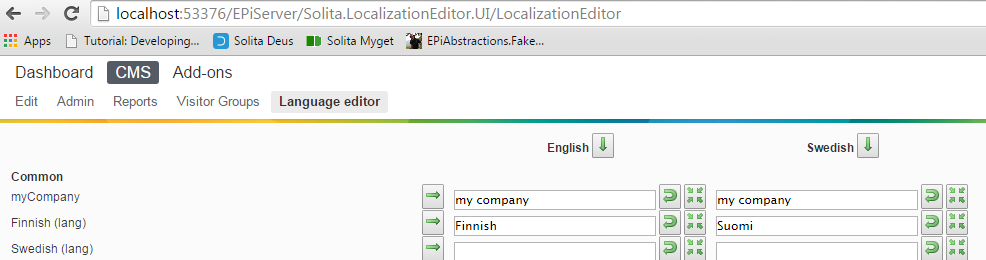
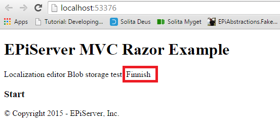

# Localization Editor

LocalizationEditorin tarkoituksena on tarjota käyttöliittymä kielikäännösten hallintaan. Editori otetaan käyttöön projekteissa includaamalla LocalizationEditor Nugetin kautta: https://www.myget.org/feed/solita-episerver/package/nuget/Solita.LocalizationEditor.UI .

Kategorioiden/kielikäännösten määritys:

    ```C#
        public class Localizations
        {
			[LocalizationCategory("Common", 100)]
			public static class Common
			{
				[Localization(Description = "myCompany", DefaultValue = "myCompany")]
				public const string Sitename = "/common/sitename";
			}
		}
    ```
LocalizationCategoryt ja Localization stringit näkyvät editorin vasemmassa reunassa, kuten kuvassa:



Itse kielikäännökset(kuvassa *English* ja *Swedish* alla) luetaan xml tiedostosta, käytössä olevaa FileAccessStrategya hyödyntäen(oletuksena Blob strategy)
VPP-tekniikkaa hyödyntävät providerit eivät ole yhteensopivia Episerver >= 9 kanssa. VPP-tekniikkaa hyödyntävä accessStrategy on kuitenkin saatavilla tiedostossa(**VppFileAccessStrategy.cs**)

Käännöksen hakeminen käyttöliittymässä(*.cshtml)

    ```html
        <p>Localization editor Blob storage test: @Html.Translate("/common/languagemenufi")</p>
    ```

**Solita.LocalizationEditor.TestProject** Up&Running:(haettu käännös /common/languagemenufi)



## Ominaisuudet
- Lokalisointien muokkaus
- Lokalisointien exportoiminen .csv tiedostoksi
- Lokalisointien importointi .csv formaatista
- Oletus arvojen asettaminen käännöksille

## Migraatio epi 9 versioon
- Exportataan lokalisoinnit csv tiedostoon(export napista).
- Päivitetään LocalizationEditor nugetin kautta uuteen versioon.
- Importataan lokalisoinnit csv tiedostosta.
- Vaihtoehtoisesti lokalisoinnit voi importoida xml tiedostosta(käyttäen Import XML nappia)

## Toimintamalli:
- Ladataan kaikki käännöskategoriat ja käännössanat App domainiin ladatuista assemblyista, kuten esimerkissä
    - Laajempi esimerkki käännökategorioiden rekisteröimisestä: **Solita.LocalizationEditor.TestEpiProject\Localizations.cs**
    - Kategoria rekisteröidaan attribuutilla **[LocalizationCategory("Kategorian nimi", "<int>")]**, jossa <int> = järjestysnumero
    - Käännös rekisteröidään attribuutilla **[Localization(Description="xxx" DefaultValue = "xxx")]**
- Ladataan käännökset sisältävä xml hydyntäen annettua **FileAccessStrategy** toteutusta(määritetty controllerissa **LocalizationEditorController.cs**)
    - FileAccessStrategyt määritetty DAL kansiossa.
- Renderöidään xml: stä luetut käännökset käännöstaulukkoon käännöstä vastaavan kielen alle
- Kun kielikäännöksiä on muokattu taulukossa ja painettu **Save**, syntyy uusi xml tiedosto blob storageen.

## Jatkokehitys
- Buildaa solution konfiguraatiolla **DevDeploy**
    - DevDeploy konfiguraatio paketoi *Solita.LocalizationEditor.UI* projektin 
    - Kopioi tarvittavat build artifaktit *Solita.LocalizationEditor.TestEpiProject* käytettäväksi
    - Lokalisaatio editoriin tehtävät muutokset ovat välittömästi käytettävissä Epi testiprojektissa
# Testit
Kaikki yksikkötestit kuuluvat olla vihreällä. Muuten jokin keskeinen toiminnallisuus on rikki.

## Build targetit
Custom build targetit on määritetty **Solita.LocalizationEditor.UI.csproj** tiedostossa(tiedoston lopussa), aktivoituvat vain mikäli konfiguraatioksi valittu "DevDeploy"

## Huomioitavaa

Kun Episerver.Framework paketin päivittää versioon >= 9, epi saitin lataaminen aiheuttaa "NullReference" Exceptionin mikäli web.config: ssa on VPP määrityksiä lokalisaatioita varten.
Huomioitavaa on myös, että reposta ei ole poistettu mitään VPP-pohjaista lokalisointitekniikkaa, LocalizationPersister luokkaa on vain refaktoroitu niin, että käytettävä Data-access tekniikka
initialisoidaan luokan ulkopuolella. Alkuperäinen VPP-moduuli löytyy kansiosta **DAL\VppFileAccessStrategy.cs**(aiheuttaa build-errorin mikäli yrittää buildata episerverin versiolla >= 9).

### Suorituskyky
Käyttöliittymän päivitys tehdään tällä hetkellä JQueryn avulla domia manipuloiden. Isojen käännöstiedostojen kohdalla tämä tarkoittaa käyttöliittymän "jäätymistä".
Jatkossa voisikin miettiä renderöinnin hoitamista data-binding tekniikoiden(esim. knockout tai reactjs), jotta editorista saataisiin käytettävämpi.
